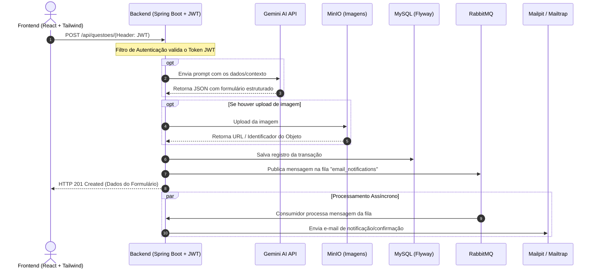

<div align="center">

# 🎓 PROBEND (Nome Provisório)


</div>

# Nota sobre a Live Demo
A Digital Ocean saiu da iniciativa do Student Developer Pack oferecido pelo Github, consequentemente, os créditos que ela oferecia "expiraram".
Desativei a Live Demo temporariamente, peço desculpas.
Irei fazer uma transição para o Microsoft Azure nos próximos dias.

### 📌 Sobre o Projeto + Stack Completa
<div align="center">
É uma plataforma voltada para a criação, compartilhamento e renderização de questões  de matemática e de algoritmos de diferentes linguagens de programação.
<br><br>
Está sendo um projeto pessoal que uso para aprender tecnologias e conceitos que podem ser aplicados em uma Stack com Java Spring Boot e React. Por conta disso, existem vários comentários pelos arquivos do projeto.<br><br>

[](https://github.com/users/jalvmiller/projects/3/views/1)
[](#decisoes-de-arquitetura)
</div>

### **♠️Backend (Tecnologias Estruturais) & APIs**
  **Java 21 & Spring Boot 3** — Núcleo e lógica da aplicação REST API\
  **Spring Security & JWT** — Autenticação *stateless* e controle de acesso granular\
  **Spring Data JPA & Hibernate** — Mapeamento objeto-relacional (ORM)\
  **MySQL 8.0** — Banco de dados relacional oficial\
  **Flyway** — Versionamento e migração automatizada de schemas\
  **Springdoc OpenAPI** — Documentação interativa e testável das rotas

### **🔧Mensageria, Storage & Serviços Integrados**
  **RabbitMQ & Spring AMQP** — Fila de mensagens para tarefas assíncronas (ex: envio de e-mails)\
  **MinIO SDK** — Armazenamento local compatível com AWS S3 para mídias/anexos\
  **Mailpit** — Servidor local para captura e visualização de e-mails de teste

### **📚Frontend & Interface**
  **React 18 & Vite** — Interface reativa com compilação e HMR\
  **Axios** — Cliente HTTP para integração com as APIs\
  **KaTeX / MathJax** — Engine para renderização de fórmulas matemáticas em LaTeX\
  **CSS Customizado** — Layout responsivo e estilização modular

### 🚀 Painéis e Serviços Locais;

Após subir via docker compose, utilize os links abaixo para acessar as interfaces administrativas e serviços dev:

| Serviço | Porta | URL de Acesso | Credenciais Padrão |
| :--- | :---: | :--- | :--- |
| **Frontend App** | `5173` | [localhost:5173](http://localhost:5173) | *N/A* |
| **Backend API & Swagger UI** | `8080` | [localhost:8080/api/swagger-ui/index.html](http://localhost:8080/api/swagger-ui/index.html) | *Acesso público* |
| **MinIO Console** | `9001` | [localhost:9001](http://localhost:9001) | `minioadmin` / `minioadminpassword` |
| **MinIO API (S3 Endpoint)** | `9000` | [localhost:9000](http://localhost:9000) | *Definidas via SDK / .env* |
| **RabbitMQ Management** | `15672` | [localhost:15672](http://localhost:15672) | `guest` / `guest` |
| **Mailpit Web UI** | `8025` | [localhost:8025](http://localhost:8025) | *Sem autenticação* |

---

### 🔧 Passos para Executar (pré-requisitos: Docker e **Docker Compose** instalados);

#### ⚡ 1. Modo Híbrido (Recomendado para Desenvolvimento Local)
Neste modo, o Docker gerencia apenas bancos e mensageria em segundo plano, enquanto Backend e Frontend rodam diretamente no host com **Live Reload** e depuração instantânea:

```bash
# 1. Copie o arquivo de variáveis de ambiente
cp .env.example .env

# 2. Suba apenas a infraestrutura (MySQL, Redis, RabbitMQ, MinIO, Mailpit)
docker compose up -d
# (ou explicitamente: docker compose --profile infra up -d)

# 3. Em um terminal, inicie o Backend (Spring Boot com profile 'dev'):
cd backend
./mvnw spring-boot:run

# 4. Em outro terminal, inicie o Frontend (React + Vite):
cd frontend
npm run dev
```

#### 🐳 2. Modo Full Stack / Produção (EC2 ou Teste Completo em Contêineres)
Para subir todos os serviços encapsulados em contêineres Docker (incluindo build do backend e frontend):

```bash
docker compose --profile full up -d --build
```
*(caso esteja no EC2, basta definir `COMPOSE_PROFILES=full` no arquivo `.env` para rodar diretamente com `docker compose up -d`).*
### 📁 Estrutura de Diretórios
```text
PROBEND/
├── backend/                   ### Código fonte Java (Spring Boot)
│   ├── src/
│   │   └── main/
│   │       ├── java/br/com/joaomu/
│   │       │   ├── config/                  # Configurações de serviços (MinIO, Mail; etc)
│   │       │   ├── controller/              # Endpoints REST (Auth, Usuários, Questões, etc)
│   │       │   ├── dto/                     # Data Transfer Objects
│   │       │   ├── listener/                # Listeners de mensageria (RabbitMQ)
│   │       │   ├── model/                   # Entidades JPA
│   │       │   ├── repo/                    # Repositórios JPA
│   │       │   ├── security/                # Filtros e configurações de segurança JWT
│   │       │   └── service/                 # Regras de negócio e integração
│   │       └── resources/
│   │           ├── db/migration/            # Migrações SQL do Flyway (V1__, V2__, etc.)
│   │           └── application.properties   # Propriedades da aplicação
│   ├── Dockerfile            # Dockerfile do backend Spring Boot
│   ├── docker-compose.yml    # Orquestração (MySQL, MinIO, RabbitMQ, Mailpit, Backend)
│   └── pom.xml               # Arquivo de dependências Maven
│
├── frontend/                 ### Código fonte React (Vite)
│   ├── src/
│   │   ├── assets/           # Arquivos estáticos (imagens, ícones, etc)
│   │   ├── components/       # Componentes reutilizáveis
│   │   ├── contexts/         # Contextos globais (ex: AuthContext)
│   │   ├── hooks/            # Hooks customizados (ex: useUser)
│   │   ├── pages/            # Telas da aplicação (Login, Perfil, Configurações)
│   │   ├── services/         # Serviços de integração com a API REST (api.js)
│   │   └── utils/            # Utilitários (ex: renderizadores LaTeX)
│   ├── package.json          # Dependências frontend
│   └── vite.config.js        # Configuração do Vite
│
└── README.md                 # Instruções e documentação geral do projeto
```

### 🔎 Diagrama Sequencial em Mermaid (Criação de Questão)

<br>

---

<a id="decisoes-de-arquitetura"></a>
### Decisões de Arquitetura
```bash
☕ Java & Spring Boot
- Todo meu contato com POO foi feito através do Java na faculdade. 
Sendo assim, foi a linguagem que me deixou mais confortável para desenvolver o projeto,
e o Spring Boot é o framework mais utilizado para criação de APIs REST escaláveis em Java.

🔐 Spring Security + JWT
- Autenticação *stateless* baseada em tokens.
Achei interessante implementar uma camada de segurança,
já que o objetivo é desenvolver algo próximo de uma aplicação web completa. 
Sinto que implementar JWT me acrescentou conhecimento em autenticação no geral;
além disso, essa é a mais indicada para APIs consumidas por SPA como o React.

🗄️ MySQL 8.0 + Flyway
- O MySQL é o banco de dados relacional que eu tinha mais familiaridade em utilizar.
E é amplamente usado no mercado;. O Flyway garante o versionamento controlado do schema.
O Hibernate estava responsável pela criação das tabelas no banco,
mas ele não é um serviço dedicado para isso, ele não oferece o mesmo controle.

🐰 RabbitMQ & Spring AMQP
- Queria implementar mensageria; RabbitMQ é mais fácil em comparação ao Kafka;
e eu ainda não havia tido contato. Por enquanto, só implementei o envio de e-mails
de notificação/confirmação de forma local com o (mailpit/mailtrap). 

🪣 MinIO SDK (S3 Compatible)
- Armazenar imagens e mídias de questões em ambiente local usando a API padrão do AWS S3.
É usado amplamente por aplicações web em produção, e foi uma oportunidade para estudar
sobre armazenamento de mídia e contato com o S3.

✉️ Mailpit
- Captura de e-mails em ambiente de desenvolvimento sem necessitar de credenciais SMTP externas
(envio para endereço real de email). Enfrentei alguns obstáculos quando tentei usar SMTP externamente,
então optei usar o Mailpit, por enquanto.

⚛️ React + Vite + KaTeX
- O Vite é bem leve, oferece compilação ultrarrápida e Hot Module Replacement (HMR);
quesitos necessários para lidar com o React. O KaTeX foi integrado para renderizar fórmulas matemáticas
em LaTeX e cumprir com a proposição do projeto de ter uma boa experiência visual.
```
