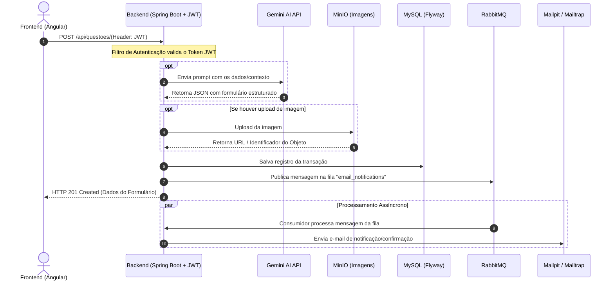

<div align="center">

# 🎓 PROBEND (Nome Provisório)


</div>

### 📌 Sobre o Projeto + Stack Completa
<div align="center">
É uma plataforma voltada para a criação, compartilhamento e renderização de questões de matemática e de algoritmos de diferentes linguagens de programação.
<br><br>
Aplicação full stack moderna com foco em arquitetura limpa, segurança, mensageria e boas práticas de engenharia de software.<br><br>

[](https://github.com/users/jalvmiller/projects/3/views/1)
[](#decisoes-de-arquitetura)
</div>

### **♠️Backend (Tecnologias Estruturais) & APIs**
  **Java 21 & Spring Boot 3** — Núcleo e lógica da aplicação REST API\
  **Spring Security & JWT** — Autenticação *stateless* e controle de acesso granular\
  **Spring Data JPA & Hibernate** — Mapeamento objeto-relacional (ORM)\
  **MySQL 8.0** — Banco de dados relacional oficial\
  **Flyway** — Versionamento e migração automatizada de schemas\
  **Springdoc OpenAPI** — Documentação interativa e testável das rotas

### **🔧Mensageria, Storage & Serviços Integrados**
  **RabbitMQ & Spring AMQP** — Fila de mensagens para tarefas assíncronas (ex: envio de e-mails)\
  **MinIO SDK** — Armazenamento local compatível com AWS S3 para mídias/anexos\
  **Mailpit** — Servidor local para captura e visualização de e-mails de teste

### **📚Frontend & Interface**
  **Angular & TypeScript** — Interface SPA moderna com componentes standalone e arquitetura modular\
  **RxJS & HttpClient** — Comunicação reativa e interceptores HTTP com a API REST\
  **KaTeX** — Renderização de fórmulas matemáticas em LaTeX\
  **PrismJS** — Realce de sintaxe de código para diferentes linguagens\
  **CSS Customizado** — Layout responsivo e estilização modular

### 🚀 Painéis e Serviços Locais;

Após subir via docker compose, utilize os links abaixo para acessar as interfaces administrativas e serviços dev:

| Serviço | Porta | URL de Acesso | Credenciais Padrão |
| :--- | :---: | :--- | :--- |
| **Frontend App (Angular)** | `4200` | [localhost:4200](http://localhost:4200) | *N/A* |
| **Backend API & Swagger UI** | `8080` | [localhost:8080/api/swagger-ui/index.html](http://localhost:8080/api/swagger-ui/index.html) | *Acesso público* |
| **MinIO Console** | `9001` | [localhost:9001](http://localhost:9001) | `minioadmin` / `minioadminpassword` |
| **MinIO API (S3 Endpoint)** | `9000` | [localhost:9000](http://localhost:9000) | *Definidas via SDK / .env* |
| **RabbitMQ Management** | `15672` | [localhost:15672](http://localhost:15672) | `guest` / `guest` |
| **Mailpit Web UI** | `8025` | [localhost:8025](http://localhost:8025) | *Sem autenticação* |

---

### 🔧 Passos para Executar (pré-requisitos: Docker e **Docker Compose** instalados);

#### ⚡ 1. Modo Híbrido (Recomendado para Desenvolvimento Local)
Neste modo, o Docker gerencia apenas bancos e mensageria em segundo plano, enquanto Backend e Frontend rodam diretamente no host com recarregamento instantâneo:

```bash
# 1. Copie o arquivo de variáveis de ambiente
cp .env.example .env

# 2. Suba apenas a infraestrutura (MySQL, Redis, RabbitMQ, MinIO, Mailpit)
docker compose up -d
# (ou explicitamente: docker compose --profile infra up -d)

# 3. Em um terminal, inicie o Backend (Spring Boot com profile 'dev'):
cd backend
./mvnw spring-boot:run

# 4. Em outro terminal, inicie o Frontend (Angular):
cd frontend
npm start
# (ou ng serve, acessível em http://localhost:4200)
```

#### 🐳 2. Modo Full Stack / Produção (EC2 ou Teste Completo em Contêineres)
Para subir todos os serviços encapsulados em contêineres Docker (incluindo build do backend e frontend):

```bash
docker compose --profile full up -d --build
```
*(caso esteja no EC2, basta definir `COMPOSE_PROFILES=full` no arquivo `.env` para rodar diretamente com `docker compose up -d`).*

### 📁 Estrutura de Diretórios
```text
PROBEND/
├── backend/                   ### Código fonte Java (Spring Boot)
│   ├── src/
│   │   └── main/
│   │       ├── java/br/com/joaomu/
│   │       │   ├── config/                  # Configurações de infraestrutura (MinIO, Mail, Cors, Seeder)
│   │       │   ├── controller/              # Endpoints REST (Auth, Questões, Resoluções, Comentários, IA)
│   │       │   ├── dto/                     # Data Transfer Objects (Request e Response com validação)
│   │       │   ├── entity/                  # Entidades JPA de domínio
│   │       │   ├── listener/                # Listeners de mensageria assíncrona (RabbitMQ)
│   │       │   ├── repository/              # Interfaces Spring Data JPA
│   │       │   ├── security/                # Filtros, JWT e regras do Spring Security
│   │       │   └── service/                 # Regras de negócio e integrações
│   │       └── resources/
│   │           ├── db/migration/            # Migrações versionadas do Flyway (V1__ até V7__)
│   │           └── application.properties   # Propriedades da aplicação
│   ├── Dockerfile            # Dockerfile multi-stage do backend
│   └── pom.xml               # Dependências Maven e plugins de build
│
├── frontend/                 ### Código fonte Angular (TypeScript)
│   ├── src/
│   │   ├── app/
│   │   │   ├── directives/   # Diretivas customizadas (ex: renderização KaTeX)
│   │   │   ├── guards/       # Guards de rota para controle de acesso/autenticação
│   │   │   ├── header/       # Componentes estruturais de navegação
│   │   │   ├── interceptors/ # Interceptores HTTP (injeção de CSRF e tokens)
│   │   │   ├── models/       # Interfaces e modelos TypeScript de domínio
│   │   │   ├── pages/        # Telas da aplicação (Login, Questões, Perfil)
│   │   │   └── services/     # Serviços de comunicação HTTP com a API REST
│   │   ├── main.ts           # Ponto de entrada da aplicação Angular
│   │   └── styles.css        # Folha de estilos globais
│   ├── angular.json          # Configurações do Angular CLI
│   ├── Dockerfile            # Dockerfile multi-stage com Nginx
│   └── package.json          # Dependências do frontend e scripts
│
├── docker-compose.yml        # Orquestração completa (MySQL, Redis, MinIO, RabbitMQ, Mailpit, etc.)
└── README.md                 # Documentação geral do projeto
```

### 🔎 Diagrama Sequencial em Mermaid (Criação de Questão)

```mermaid
sequenceDiagram
    autonumber
    actor Cliente as Frontend (Angular)
    participant API as Backend (Spring Boot + JWT)
    participant Gemini as Gemini AI API
    participant MinIO as MinIO (Imagens)
    participant DB as MySQL (Flyway)
    participant Queue as RabbitMQ
    participant Mail as Mailpit / Mailtrap

    Cliente->>API: POST /api/questoes/(Header: JWT)
    Note over API: Filtro de Autenticação valida o Token JWT
    
    opt
        API->>Gemini: Envia prompt com os dados/contexto
        Gemini-->>API: Retorna JSON com formulário estruturado
    end
    opt Se houver upload de imagem
        API->>MinIO: Upload da imagem
        MinIO-->>API: Retorna URL / Identificador do Objeto
    end

    API->>DB: Salva registro da transação
    API->>Queue: Publica mensagem na fila "email_notifications"
    API-->>Cliente: HTTP 201 Created (Dados do Formulário)

    par Processamento Assíncrono
        Queue->>API: Consumidor processa mensagem da fila
        API->>Mail: Envia e-mail de notificação/confirmação
    end
```
<br>

---

<a id="decisoes-de-arquitetura"></a>
### Decisões de Arquitetura
```bash
☕ Java & Spring Boot
- Todo meu contato com POO foi feito através do Java na faculdade. 
Sendo assim, foi a linguagem que me deixou mais confortável para desenvolver o projeto,
e o Spring Boot é o framework mais utilizado para criação de APIs REST escaláveis em Java.

🔐 Spring Security + JWT
- Autenticação *stateless* baseada em tokens.
Achei interessante implementar uma camada de segurança,
já que o objetivo é desenvolver algo próximo de uma aplicação web completa. 
Sinto que implementar JWT me acrescentou conhecimento em autenticação no geral;
além disso, essa é a mais indicada para APIs consumidas por SPA como o Angular.

🗄️ MySQL 8.0 + Flyway
- O MySQL é o banco de dados relacional que eu tinha mais familiaridade em utilizar.
E é amplamente usado no mercado;. O Flyway garante o versionamento controlado do schema.
O Hibernate estava responsável pela criação das tabelas no banco,
mas ele não é um serviço dedicado para isso, ele não oferece o mesmo controle.

🐰 RabbitMQ & Spring AMQP
- Queria implementar mensageria; RabbitMQ é mais fácil em comparação ao Kafka;
e eu ainda não havia tido contato. Por enquanto, só implementei o envio de e-mails
de notificação/confirmação de forma local com o (mailpit/mailtrap). 

🪣 MinIO SDK (S3 Compatible)
- Armazenar imagens e mídias de questões em ambiente local usando a API padrão do AWS S3.
É usado amplamente por aplicações web em produção, e foi uma oportunidade para estudar
sobre armazenamento de mídia e contato com o S3.

✉️ Mailpit
- Captura de e-mails em ambiente de desenvolvimento sem necessitar de credenciais SMTP externas
(envio para endereço real de email). Enfrentei alguns obstáculos quando tentei usar SMTP externamente,
então optei usar o Mailpit, por enquanto.

🅰️ Angular + KaTeX + PrismJS
- O Angular foi adotado para estruturar o frontend com uma arquitetura robusta e tipada em TypeScript,
utilizando componentes standalone, injeção de dependência e interceptores HTTP para tokens e CSRF.
O KaTeX foi integrado para renderizar fórmulas matemáticas em LaTeX e o PrismJS para realce de sintaxe
de trechos de código, garantindo uma experiência técnica rica para o usuário.
```
